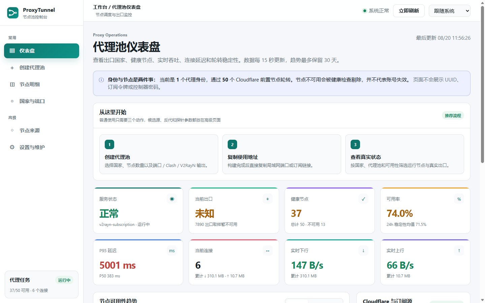
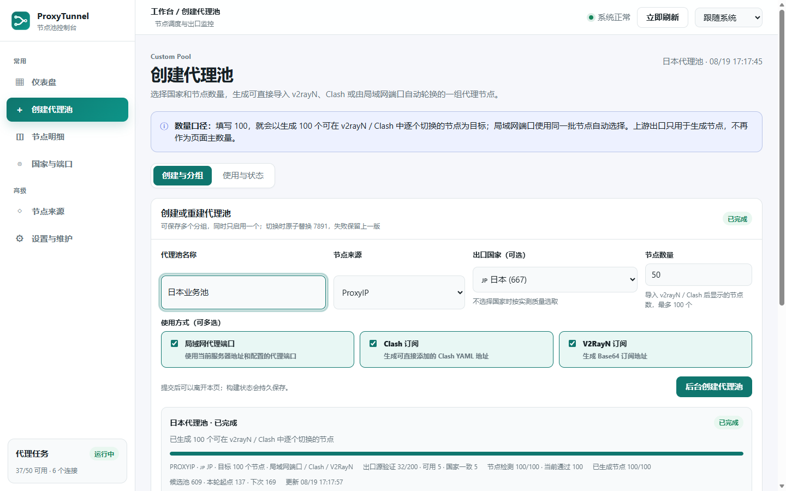
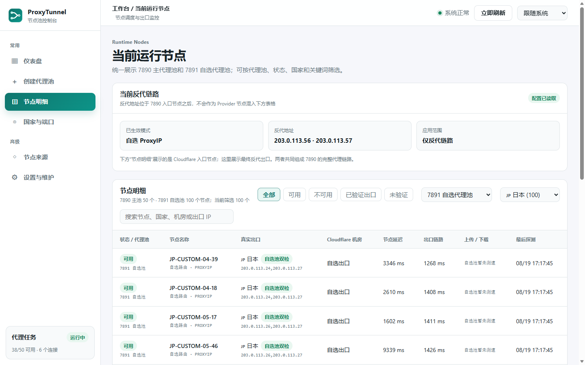
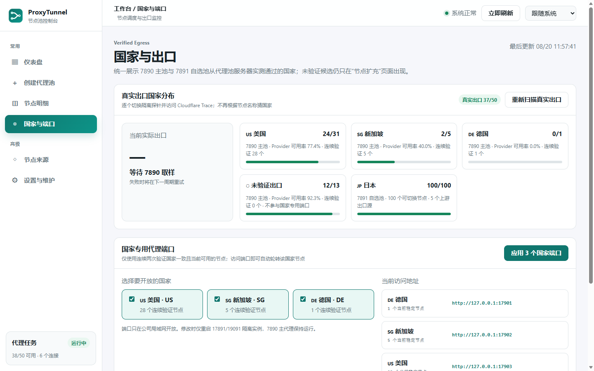

<p align="center">
  
</p>

<h1 align="center">ProxyTunnel</h1>

<p align="center">在一台主机维护代理池，并通过局域网端口、Clash 与 V2RayN 订阅提供给多台可信设备。</p>

<p align="center"><a href="README.md">简体中文</a> · <a href="README_EN.md">English</a></p>

> [!WARNING]
> ProxyTunnel 当前为 `0.1.0-alpha.1`。它已经可以构建、测试并运行本地控制台，但还没有达到可以直接暴露到公网或作为稳定发行版使用的程度。请仅在你有权管理的网络、Cloudflare 账户和节点上使用，并遵守当地法律及服务商条款。

## 项目简介

ProxyTunnel 将 Cloudflare 上的 EdgeTunnel 数据面、Mihomo 代理运行时和本地运维控制台组合成一个可观测、可管理的节点池系统。

项目重点不是重新实现 EdgeTunnel 协议，而是在它之上补齐日常运维能力：候选节点发现、真实出口验证、国家筛选、自选代理池、独立端口、Clash/v2rayN 订阅、后台构建任务、历史分组、健康状态和人工操作记录。

一句话理解：**ProxyTunnel 管的是一组可验证、可轮换、可复用的代理节点，而不是单个代理地址。** 节点池部署在一台 Windows 主机后，本机程序、同一可信局域网内的电脑和手机、Clash、v2rayN 以及支持 HTTP/SOCKS 代理的程序可以按各自习惯使用同一批节点。

当前代码来自一个已实际运行的内部版本，但已经做了独立项目化处理：生产配置、密钥、日志、节点快照、公司名称、固定局域网 IP 和无关系统入口都没有进入本仓库。

## 实际界面

以下截图由当前 `main` 分支的真实界面生成。运行统计来自实际部署，但域名、局域网地址、出口 IP 和 Cloudflare 项目标识均已替换为示例值；截图不包含 UUID、订阅令牌、密码或 Controller 密钥。点击图片可查看原尺寸。

<table>
  <tr>
    <td width="50%"><a href="docs/images/dashboard.png"></a><br><strong>代理池仪表盘</strong><br>集中查看健康节点、可用率、延迟、连接和吞吐。</td>
    <td width="50%"><a href="docs/images/create-pool.png"></a><br><strong>创建代理池</strong><br>按来源、国家和数量构建命名分组，并同时选择端口、Clash、V2RayN 输出。</td>
  </tr>
  <tr>
    <td width="50%"><a href="docs/images/runtime-nodes.png"></a><br><strong>运行节点明细</strong><br>按代理池、国家和状态筛选节点，查看经过脱敏的真实出口验证结果。</td>
    <td width="50%"><a href="docs/images/country-ports.png"></a><br><strong>国家与专用端口</strong><br>把连续验证通过的国家节点分配到隔离端口，主池无需中断。</td>
  </tr>
</table>

## 多设备与多场景使用

ProxyTunnel 只需要集中维护一套节点池，各设备不需要重复维护节点列表。对外提供的是标准端口或订阅，不要求每个使用者打开管理控制台。

| 场景 | 接入方式 | 适合用途 |
| --- | --- | --- |
| 服务器本机 | `127.0.0.1:7890` 或 `127.0.0.1:7891` | 开发工具、脚本、浏览器和后台服务统一走代理池 |
| 可信局域网内的其他电脑/手机 | `服务器地址:7891` | 多台设备共享同一自选池，由服务器负责健康检查和轮转 |
| Clash 客户端 | 控制台生成的 Clash YAML 订阅 | 在客户端查看并手动切换池内节点 |
| v2rayN 客户端 | 控制台生成的 Base64 订阅 | 在 Windows 客户端批量导入和切换节点 |
| 固定国家业务 | `服务器地址:17901+` | 只在已验证的指定国家节点中轮转，不影响 7890 主池 |
| 支持 HTTP/SOCKS 的程序 | 代理端口 | 爬虫、API 客户端、下载器或测试工具复用同一入口 |

默认定位是本机和可信局域网内部工具。如果多个地点已经通过企业 VPN、Tailscale、ZeroTier 或其他私网互联，可继续使用同一套端口；不要为了跨地点访问而把 7890、7891、9190 或管理端口直接暴露到公网。

## 用户到底需要填写什么

默认配置已经包含本机端口、目录、Provider 名称、日志位置、轮询周期和 30 天保留策略。普通用户不需要复制并填写三十多个参数。

| 场景 | 必填内容 | 自动处理 | 可选内容 |
| --- | --- | --- | --- |
| 已有 CF ProxyTunnel | `ADMIN` 管理密码；非本仓库部署时补一次网站地址 | 登录 Worker、自动取得订阅、生成本机配置并启动全部服务 | 是否允许可信局域网访问 |
| 还没有 CF ProxyTunnel | 无 | 打开部署教程，完成后重新运行 `START.cmd` | Wrangler 自动部署或教程手动部署 |
| 部署 Cloudflare EdgeTunnel | 一个 `ADMIN` 管理密码 | Wrangler 登录、Worker 构建、KV 创建与 `KV` 绑定 | 自定义域名 |
| 本机 Mihomo | `bin\mihomo.exe` 或高级配置里的现有路径 | 自动生成主池配置和 Controller 密钥 | 探针和高级端口 |

Cloudflare 账户登录是一次浏览器授权，不是项目配置字段。Workers KV 不需要用户复制 Namespace ID：当前 Wrangler 会在首次部署时自动创建资源并把它绑定为 `KV`。`UUID`、订阅 Token 和 Clash 地址由 EdgeTunnel 根据 `ADMIN` 派生，`START.cmd` 会在登录后自动取得，不要求用户复制。

> 新机器要运行完整代理转发，仍需准备 Mihomo 和你有权管理的 CF ProxyTunnel 部署。本仓库不会把代理二进制、派生订阅或生产密钥打包进去。

## 当前状态

| 项目 | 状态 | 说明 |
| --- | --- | --- |
| Go 后端 | 可构建、可测试 | 提供监控、候选目录、出口验证和控制 API |
| Web UI | 可运行 | 支持桌面/窄屏、明暗主题、多页面导航和任务进度 |
| Windows 管理适配器 | Alpha 可用 | 仍依赖 PowerShell 7、Windows Scheduled Tasks 和 Mihomo |
| EdgeTunnel 集成 | 已固定且可审计 | Git submodule 固定上游；构建补丁移除跨请求全局状态和远程管理页依赖 |
| Wrangler 本地校验 | 可用 | 支持 dev、dry-run 和启动性能检查 |
| 完整运行时引导 | Alpha 可用 | 按“已有 CF / 没有 CF”分流；不会代替用户创建账户或偷偷部署 |
| 公网安全 | 不支持 | 尚缺正式管理员认证、CSRF Token、限流和审计增强 |
| 根项目许可证 | GPL-2.0-only | 与固定的 EdgeTunnel 上游许可证保持兼容 |

## 主要功能

- **节点池总览**：显示主池、自选池、可用率、延迟、流量、连接数和当前出口。
- **候选节点目录**：读取 ProxyIP、SOCKS5、HTTP 和 HTTPS 候选源，支持分页、搜索和国家筛选。
- **真实出口验证**：通过隔离链路探测真实出口 IP、国家、Cloudflare 机房和延迟，而不是仅相信节点名称。
- **批量与自动选择**：支持批量验证、按国家自动选取、持久游标轮转和失败跳过。
- **自选代理池**：按名称、来源、国家和目标数量创建可复用分组。
- **多种输出方式**：同一分组可以同时提供局域网代理端口、Clash YAML 和 v2rayN Base64 订阅。
- **独立运行与回滚**：自选池默认使用独立端口；构建失败时保留上一版，减少对主代理池的影响。
- **历史分组**：保留已创建代理池的配置和节点快照，可以重新检测或直接切换。
- **国家专用端口**：可以为通过连续出口验证的国家分配独立代理入口。
- **后台任务**：节点池构建可在页面关闭后继续运行，支持进度、取消、重试和状态恢复。
- **运行记录**：记录人工扫描、测速、订阅刷新、重启和配置变更结果。
- **Cloudflare 管理适配**：预留 Cloudflare Ops API 接口；默认关闭，只有显式配置后才启用。

## 架构

```text
Cloudflare Workers / Pages
cmliu/edgetunnel 数据面
            │
            │ 订阅、配置与健康状态
            ▼
Mihomo 主代理池 :7890 ─────────────────────┐
Mihomo 自选代理池 :7891                    │ Controller API
Mihomo 隔离探针 :17891 / :17901+           │
            ▲                              ▼
Windows 任务适配器 ◀──────────── Go 后端 :9191
            ▲                              ▲
            └──────── Web 网关 :9190 ──────┘
                              │
                              ▼
                           浏览器
```

组件职责：

| 组件 | 位置 | 职责 |
| --- | --- | --- |
| Go 后端 | `cmd/proxytunnel/main.go`、`cmd/proxytunnel/catalog.go` | 监控、候选目录、出口探测、历史数据和控制 API |
| Web UI | `cmd/proxytunnel/web/index.html` | 仪表盘、筛选、代理池构建、操作确认和日志展示 |
| Web 网关 | `scripts/windows/monitor-ui-gateway.ps1` | 对外提供 9190、聚合 API、处理后台任务与订阅下载 |
| 自选池管理器 | `scripts/windows/custom-pool-manager.ps1` | 生成 Mihomo 配置、验证路由、切换或回滚 7891 |
| 构建 Worker | `scripts/windows/pool-build-worker.ps1` | 持久化后台构建进度、游标、取消状态和结果 |
| EdgeTunnel 上游 | `third_party/edgetunnel` | Cloudflare Workers/Pages 数据面 |
| Mihomo | 外部依赖 | 实际代理转发、健康检查和节点切换 |

更完整的说明见 [docs/architecture.md](docs/architecture.md)。

## 默认端口

| 端口 | 用途 | 是否建议局域网开放 |
| --- | --- | --- |
| `9190` | Web UI 和 Windows 网关 | 是，仅允许可信局域网 |
| `9191` | Go 后端 API | 否，建议仅监听回环地址 |
| `7890` | Mihomo 主代理入口 | 按实际需求开放 |
| `7891` | Mihomo 自选代理池入口 | 按实际需求开放 |
| `9090` | 主池 Mihomo Controller | 否 |
| `17891` | 隔离探针代理入口 | 否 |
| `19091` | 隔离探针 Controller | 否 |
| `19092` | 自选池 Controller | 否 |
| `17901+` | 国家专用代理入口 | 仅开放实际启用的端口 |
| `8787` | Wrangler 本地开发 | 否，仅开发时使用 |

端口都可以通过配置或脚本参数调整。不要将 Controller、内部 API 或订阅管理接口直接暴露到公网。

## 项目目录

```text
proxytunnel/
├─ cmd/proxytunnel/               # Go 后端、测试和内嵌 Web UI
├─ cloudflare/                    # Worker、Wrangler、Node 依赖和部署入口
├─ configs/
│  ├─ config.example.json         # 无需填写的最小配置
│  └─ config.advanced.example.json # 完整高级配置参考
├─ docs/
│  ├─ architecture.md             # 架构与组件边界
│  └─ cloudflare-edgetunnel.md    # Cloudflare / EdgeTunnel 集成
├─ scripts/
│  ├─ bootstrap.ps1               # 初始化依赖与验证
│  ├─ build.ps1                   # 构建 Windows 二进制
│  ├─ test.ps1                    # Go、PowerShell、Wrangler 校验
│  └─ windows/                    # 当前 Windows 运行适配器
├─ third_party/edgetunnel/        # 固定 commit 的 Git submodule
├─ var/                           # START.cmd 生成的本地运行数据，不会提交
├─ START.cmd                      # 普通用户唯一入口：双击即可运行
├─ STOP.cmd                       # 停止由 START.cmd 启动的本机进程
├─ README.md                      # 中文说明
└─ README_EN.md                   # English guide；顶部可互相切换
```

## 环境要求

普通本地运行只需要：

- 推荐：64 位 Windows 11 或 Windows Server；64 位 Windows 10 22H2 尽力兼容
- Go 1.26+
- PowerShell 7.4+（双击入口会自动检查）

Git 只用于克隆和更新代码。真正提供本机代理端口还需要 Mihomo 和你自己的 CF ProxyTunnel；`START.cmd` 会使用网站地址与 `ADMIN` 安全登录并自动配置 Clash 订阅，不会把空控制台误报为“可用”。Node.js 22+、npm、Cloudflare 账户只用于开发或部署 Cloudflare Worker。Docker Desktop 不是必需项。

Windows 10 可以运行。这里的“完整运行适配器仅支持 Windows”是指当前尚未提供 Linux/macOS 适配器，并不是只支持 Windows 11。更旧的 Windows 10 版本不在兼容范围内。

## 快速启动：先选你的情况

### 1. 获取代码

```powershell
git clone --recurse-submodules https://github.com/suakitsu/proxytunnel.git
```

### 2A. 已有 CF ProxyTunnel

1. 将 Mihomo 可执行文件放到 `bin\mihomo.exe`；已有非默认安装可在高级配置中指定路径。
2. 双击 `START.cmd`，选择“已有”。
3. 如果是本仓库的 `cloudflare\DEPLOY.cmd` 部署，网站地址会自动复用；其他部署只需首次粘贴网站首页或 `/admin` 地址。
4. 在安全输入框填写部署时设置的 **`ADMIN` 管理密码**。

脚本会登录你自己的 Worker，读取运行时 `HOST`/`UUID` 并自动生成正确的 Clash 订阅地址。`ADMIN` 只在内存中使用，绝不保存；网站地址和派生订阅保存在不会提交的 `var/`。随后脚本生成 Mihomo 主池配置和随机 Controller 密钥，并启动 `7890`、`9090`、`9191`、`9190`。四层真正就绪后才会显示“可使用”并打开页面：

```text
控制台：http://127.0.0.1:9190/
本机代理：http://127.0.0.1:7890
```

以后只需双击 `START.cmd`，已有运行实例会直接打开。停止时双击 `STOP.cmd`。

### 2B. 还没有 CF ProxyTunnel

双击 `START.cmd` 后选择“没有”。脚本不会启动一个无代理能力的空控制台，而是打开：

- [CF ProxyTunnel / EdgeTunnel 图文部署教程](https://www.freedidi.com/23618.html)
- 或使用仓库里的 `cloudflare\DEPLOY.cmd`，按 Wrangler 的受控流程部署

部署完成后再运行 `START.cmd`，按 2A 输入同一个 `ADMIN` 密码即可；不需要去管理页寻找或复制 Clash 订阅。

如果缺少 Mihomo，脚本同样会打开其官方 Release 页面，并明确提示可执行文件应放置的位置。它不会自动下载不固定版本的代理二进制，也不会登录 Cloudflare、创建账户或擅自修改线上资源。

<details>
<summary>开发者：手动配置、构建和启动</summary>

初始化本地目录和配置：

```powershell
pwsh -NoLogo -NoProfile -ExecutionPolicy Bypass -File .\scripts\setup.ps1
```

构建后端：

```powershell
pwsh -NoLogo -NoProfile -ExecutionPolicy Bypass -File .\scripts\build.ps1
```

手动启动后端：

```powershell
.\dist\proxytunnel.exe -config .\config.local.json
```

在另一个 PowerShell 窗口启动 Web 网关：

```powershell
pwsh -NoLogo -NoProfile -ExecutionPolicy Bypass `
  -File .\scripts\windows\monitor-ui-gateway.ps1 `
  -ListenPrefix 'http://127.0.0.1:9190/' `
  -AllowedCIDR '127.0.0.0/8'
```

Cloudflare/Worker 开发环境才需要运行：

```powershell
pwsh -NoLogo -NoProfile -ExecutionPolicy Bypass -File .\scripts\bootstrap.ps1
```

本地高级配置见 [configs/config.advanced.example.json](configs/config.advanced.example.json)。仓库不会分发 Mihomo 二进制、生产订阅或控制器密钥。

</details>

## 局域网访问

推荐只对局域网开放 `9190`，让 `9191` 和 Mihomo Controller 继续监听回环地址。

示例：假设可信网段是 `192.168.1.0/24`：

```powershell
pwsh -NoLogo -NoProfile -ExecutionPolicy Bypass `
  -File .\scripts\windows\monitor-ui-gateway.ps1 `
  -ListenPrefix 'http://+:9190/' `
  -AllowedCIDR '192.168.1.0/24'
```

同时只在 Windows 防火墙中允许该可信网段访问 `9190`。如果开放 `7890`、`7891` 或国家端口，也应逐个限制来源网段。

## 配置参考

### 核心服务

| 配置项 | 说明 |
| --- | --- |
| `data_dir` | 所有默认运行目录的根路径，默认是配置文件旁的 `var` |
| `listen` | Go 后端监听地址，推荐 `127.0.0.1:9191` |
| `controller_url` | 主池 Mihomo Controller URL |
| `controller_secret_file` | 主池 Controller 密钥文件，不要直接把密钥写进 JSON |
| `provider_name` | Mihomo Provider 名称 |
| `group_name` | 用于节点切换的 Mihomo 代理组名称 |
| `proxy_url` | 主池代理入口，例如 `http://127.0.0.1:7890` |
| `egress_trace_url` | 出口检测地址，默认使用 Cloudflare Trace |
| `proxy_config_file` | 主池 Mihomo 配置文件路径 |
| `provider_file` | 主池 Provider 文件路径 |
| `proxy_task_name` | Windows 主池计划任务名称 |
| `allowed_cidr` | 允许调用变更 API 的来源网段 |

### 监控与历史

| 配置项 | 说明 |
| --- | --- |
| `history_dir` | 资源快照和操作记录目录 |
| `log_file` | Go 后端日志文件 |
| `poll_seconds` | Mihomo 状态轮询周期，最小值会被程序校正 |
| `egress_sample_seconds` | 主池真实出口采样间隔 |
| `history_seconds` | 历史快照写入间隔 |
| `retention_days` | 历史保留天数，程序限制在合理范围内 |
| `cloudflare_health_url` | 可选的 EdgeTunnel 健康检查 URL |

### 隔离探针与国家端口

| 配置项 | 说明 |
| --- | --- |
| `probe_controller_url` | 隔离探针 Mihomo Controller URL |
| `probe_secret_file` | 隔离探针 Controller 密钥文件 |
| `probe_provider_name` | 探针 Provider 名称 |
| `probe_group_name` | 探针代理组名称 |
| `probe_proxy_url` | 探针 HTTP 代理入口 |
| `probe_trace_url` | 探针出口检测地址 |
| `probe_result_file` | 探测结果持久化文件 |
| `probe_config_file` | 探针 Mihomo 配置文件 |
| `probe_provider_file` | 探针 Provider 文件 |
| `probe_task_name` | 探针 Windows 计划任务名称 |
| `mihomo_executable` | Mihomo 可执行文件路径 |
| `country_port_state_file` | 国家专用端口分配状态文件 |
| `country_port_base` | 国家端口起始值，默认 `17901` |

### 候选节点与 Cloudflare 操作

| 配置项 | 说明 |
| --- | --- |
| `candidate_state_file` | 已验证候选、自选状态和游标数据 |
| `cloudflare_ops_url` | 可选的 Cloudflare 管理适配 API；留空时关闭 |
| `cloudflare_ops_token_file` | Cloudflare 管理适配 Token 文件；不要提交 |

普通配置见 [configs/config.example.json](configs/config.example.json)，完整高级参考见 [configs/config.advanced.example.json](configs/config.advanced.example.json)。相对路径统一相对于配置文件所在目录解析，避免从不同工作目录启动时写到意外位置。

## Cloudflare 与 EdgeTunnel

本项目使用 [`cmliu/edgetunnel`](https://github.com/cmliu/edgetunnel) 作为 Cloudflare 数据面，当前固定提交：

```text
92fc6cc4a4cbfdf536394bc9b0397e5948b039f8
```

你提供的[部署帖子](https://www.freedidi.com/23618.html)描述了手动创建 KV、Pages 项目和变量的流程。本项目保留相同的 EdgeTunnel 数据面，但将常规部署收敛为：

1. 双击 `cloudflare\DEPLOY.cmd`。
2. 阅读生产变更说明并输入 `DEPLOY` 确认。
3. 浏览器完成一次 Wrangler 登录。
4. 只输入一个不少于 12 位的 `ADMIN` 管理密码。
5. Wrangler 自动创建并绑定 `KV`，完成 dry-run 后再部署 Worker。
6. 如有需要，再单独绑定自定义域；默认 `workers.dev` 地址即可运行。

ProxyTunnel 不会自动相信或复制教程中的账号、域名和示例值。第三方教程只作为部署背景，Cloudflare 配置应以官方文档和实际 Wrangler 校验为准。

### 本地 Worker 校验

```powershell
Set-Location .\cloudflare
Copy-Item .\.dev.vars.example .\.dev.vars
# 修改 cloudflare\.dev.vars 中仅供本地使用的 ADMIN
npm ci
npm run cf:dry-run
npm run cf:dev
```

`cf:dev` 使用本地 HTTPS，避免 EdgeTunnel 的 HTTPS 强制跳转在开发环境形成重定向循环。访问 Wrangler 输出的 `https://127.0.0.1:8787` 地址时，本地自签名证书出现浏览器提示属于预期行为。

其他命令：

```powershell
npm run cf:check   # 检查 Worker 启动开销
```

`cloudflare/wrangler.jsonc` 不包含生产账户、路由、KV ID 或管理员密码。它只声明绑定名 `KV`；部署脚本会要求输入必需的 `ADMIN` Secret。本地开发使用本地 KV，首次生产部署由 Wrangler 自动配置真实命名空间。账户专属 ID 只会写入被 Git 忽略的 `cloudflare/wrangler.production.jsonc`。

Wrangler 会先运行 `cloudflare/scripts/build-worker.mjs`：它从固定 commit 的上游源码生成隔离版本，将请求级拨号参数放入 `AsyncLocalStorage`，并改用仓库内置的 `/login`、`/admin` 页面。构建补丁按唯一锚点校验；上游代码发生不兼容变化时会直接失败，不会静默恢复为在线第三方页面。管理页也不接收 Cloudflare Global API Key 或 API Token，这类账户操作应留在 Dashboard 或 Wrangler 中完成。

受控生产部署入口已经提供，并包含 dry-run、显式二次确认、Secret 临时文件清理和 Wrangler 冲突检查。它不会删除 Worker、KV、路由或域名。稳定公开发行前仍需补齐 staging/production 隔离和经过演练的回滚流程。

更多说明见 [docs/cloudflare-edgetunnel.md](docs/cloudflare-edgetunnel.md)。

## 开发与验证

运行全部本地校验：

```powershell
pwsh -NoLogo -NoProfile -ExecutionPolicy Bypass -File .\scripts\test.ps1
```

包含 Cloudflare Worker dry-run：

```powershell
pwsh -NoLogo -NoProfile -ExecutionPolicy Bypass `
  -File .\scripts\test.ps1 `
  -IncludeCloudflare
```

当前验证包括：

- `gofmt`
- `go test ./...`
- `go vet ./...`
- 所有项目与 Windows 运行 PowerShell 脚本的 AST 语法解析
- EdgeTunnel 安全补丁生成及生成文件语法检查
- 可选的 Wrangler Worker dry-run

## 安全模型

当前版本包含三层基础防护：

1. Go 后端按 `allowed_cidr` 检查变更请求来源。
2. Web 网关按 `AllowedCIDR` 检查访问者地址。
3. 变更操作要求同源请求和 `X-ProxyTunnel-Action: confirmed` 二次确认头。

这些措施只能防止误操作和部分跨站请求，不能替代登录认证。公开部署前必须补齐：

- 管理员登录或管理 Token
- CSRF Token
- API 速率限制
- 会话过期与退出
- 敏感操作审计
- Secret 轮换
- 反向代理后的可信来源 IP 处理

以下内容已经被 Git 忽略，任何情况下都不应提交：

- `config.local.json`
- `.dev.vars`、`.env` 和 API Token
- Mihomo Controller Secret
- 带用户凭据的订阅
- `var/` 下的运行状态、历史和节点快照
- 日志、浏览器资料和测速产物
- 构建输出和 Wrangler 本地状态

详见 [SECURITY.md](SECURITY.md)。

## 已知限制

- 完整服务管理目前只支持 Windows。
- PowerShell 网关和管理脚本仍较大，后续需要迁移到 Go 服务层。
- Web UI 目前仍是单文件，尚未拆成可测试的组件项目。
- 候选节点来源和部分验证服务仍是外部依赖，需要增加可配置 Provider 接口。
- 当前测试主要覆盖配置生成、文件替换、国家端口和候选解析；后台任务恢复已有进程/心跳保护，但压力与故障注入测试仍不足。
- 没有正式的安装器、升级器或卸载器。
- 没有生产级用户认证。

## 路线图

### `0.1.x`：可复现基线

- 清理内部路径和生产数据。
- 固定 EdgeTunnel 上游版本。
- 完成本地构建、测试和 Wrangler dry-run。
- 补齐中英文文档。

### `0.2.x`：服务化与可靠性

- 将后台任务、锁、恢复和状态机迁移到 Go。
- 增加任务幂等、崩溃恢复和并发测试。
- 提供正式 Windows Service 安装脚本。
- 将候选节点源改成配置化 Provider。

### `0.3.x`：可公开部署

- 增加管理员认证、CSRF Token 和限流。
- 提供 Linux/systemd 或容器化部署。
- 增加 staging/production Cloudflare 部署流程。
- 发布带校验和及签名的构建产物。
- 持续执行第三方许可证审计。

## 许可证与第三方组件

ProxyTunnel 使用 [GNU GPL version 2](LICENSE)（`GPL-2.0-only`）。修改或分发时请遵守许可证中的源码提供、版权和许可证保留要求。

`third_party/edgetunnel` 是独立 Git submodule，使用 GPL-2.0。分发时必须保留其源码、许可证和上游声明。其他第三方信息见 [THIRD_PARTY_NOTICES.md](THIRD_PARTY_NOTICES.md)。

## 常见问题

### 页面显示 `Monitor backend request failed`

检查：

1. Go 后端是否正在监听 `127.0.0.1:9191`。
2. 网关的 `BackendBase` 是否与后端地址一致。
3. Controller Secret 文件是否存在。
4. Mihomo Controller 是否可访问。

### 9190 无法启动

通常是 URL ACL、端口占用或权限问题。确认端口未被占用，并使用管理员权限配置精确的 URL 前缀。不要直接开放不受限制的公网监听。

### EdgeTunnel submodule 目录为空

```powershell
git submodule update --init --recursive
```

### PowerShell 提示禁止运行脚本

使用项目提供的 `.cmd` 文件，或者仅对当前命令使用：

```powershell
pwsh -NoLogo -NoProfile -ExecutionPolicy Bypass -File <script.ps1>
```

这不会永久修改整台电脑的执行策略。

### Wrangler 显示没有 ID 的本地 `KV` 绑定

这是预期行为。本地开发使用持久化的本地 KV；执行经过确认的 Cloudflare 部署时，Wrangler 会自动创建生产 KV 并完成绑定。仓库不会提交账户专属 Namespace ID。
